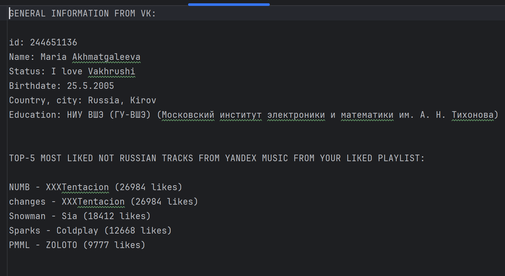

**Working with the VK API & Yandex Music API via requests**

Short description:

At the output of the program, we get the file `output.txt`, which contains basic information from your VK page and YM account.

User guide:

On [jetbrains website](https://www.jetbrains.com/ru-ru/pycharm/) download PyCharm Community Edition. Launch and install.
Save the code in a .zip archive and extract it on your PC or clone the git repository using the clone button at the top right of the screen. Open the project in pycharm.

OR

Save the file `main.py` and open it in pycharm. Install the virtual environment in pycharm using the following instructions:

In the terminal, write `pip install requests python-dotenv yandex-music` (to connect the _requests_ and _dotenv_ libraries)

Create or save an `output.txt` file to output the data.

Create a `.env` file. In it, enter the **TOKEN_VK** token (you can get it [on this website](https://vkhost.github.io/)), the **TOKEN_YM** (get it with [this Chrome extension](https://chromewebstore.google.com/detail/yandex-music-token/lcbjeookjibfhjjopieifgjnhlegmkib))  and the request URL **URL_VK**, as shown in the `.env_example` file.

    PLEASE PAY ATTENTION: 

    Encoding in Pycharm not allows output data in Cyrillic, therefore you should switch the language in VK settings to english.

Run the `main.py` file. The result will contain of general information from your VK page and TOP-5 (by likes) not russian tracks from your liked playlist. The result will be output to the `output.txt` file.

